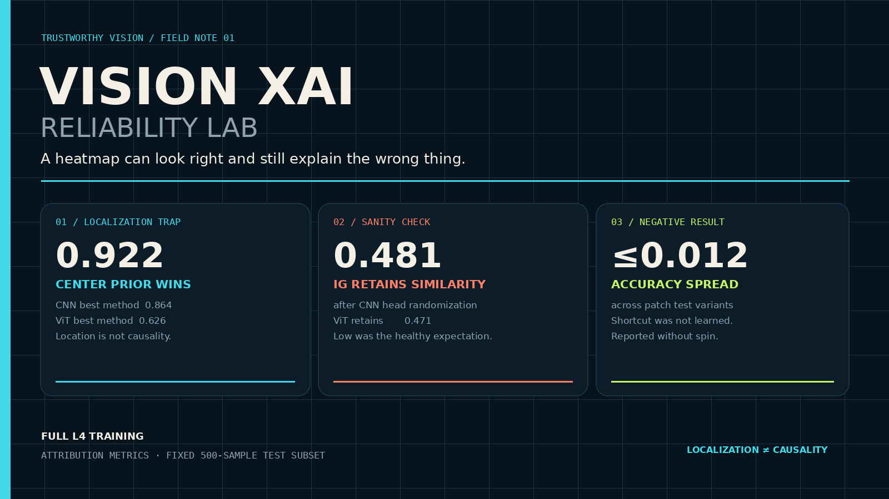
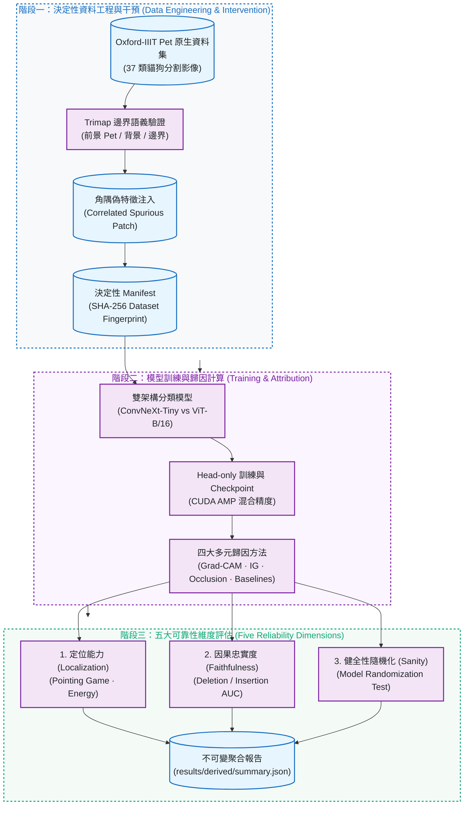
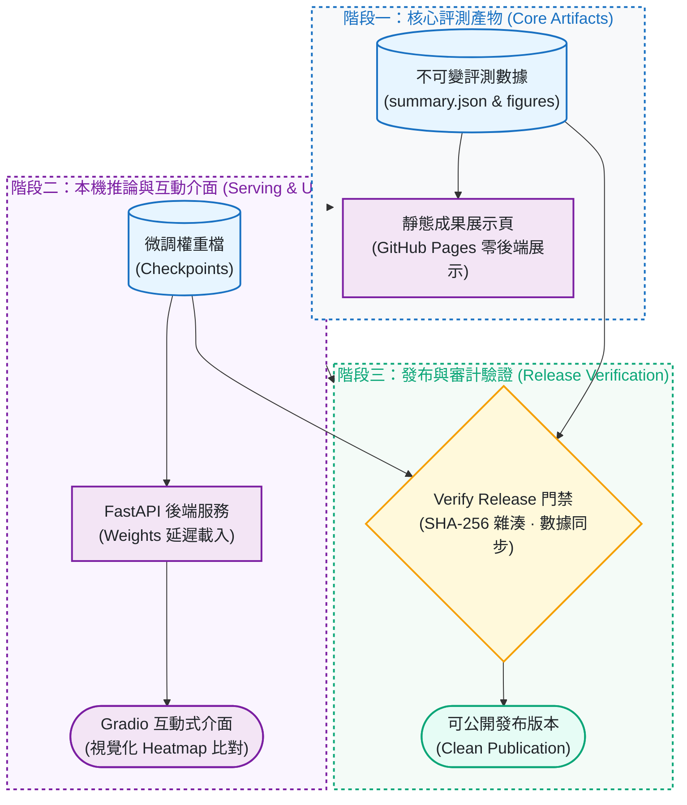

# vision-xai-reliability-lab

[](https://github.com/kuotunyu/vision-xai-reliability-lab/actions/workflows/ci.yml)


[](LICENSE)

本專案實作一套以可靠性為優先的視覺可解釋性基準測試 (Vision XAI Reliability Benchmark)：針對 ConvNeXt-Tiny 與 ViT-B/16 雙架構，實測驗證「視覺上看似合理」的歸因熱力圖 (Attribution Heatmaps) 為什麼仍可能在因果推論上失效。基準分開量測定位能力 (Localization)、因果忠實度 (Causal Faithfulness)、模型隨機化健全性 (Model Randomization Sanity)、翻轉穩定性 (Flip Stability) 與偽特徵干擾 (Spurious Cue)。

[English version](README_en.md) · [→ 互動成果導覽](https://kuotunyu.github.io/vision-xai-reliability-lab/) · [→ 快速重現](#快速開始) · [→ 證據審核 (ARTIFACTS.md)](ARTIFACTS.md) · [→ Model Card](MODEL_CARD.md)



> **熱力圖不是因果推理的證據。** 本專案不只展示解釋視覺化，而是以嚴謹的統計指標量測解釋在何處成立、在何處失效，並透過不可變 Hash 簽章保護評測證據不被 Smoke 測試或 CI 流程改寫。

---

## 核心發現與方法學翻轉

1. **Center Prior 偏差暴露**：
   固定 Center Prior 在兩種模型的 Pointing Game 都達到 **0.922**，超越所有實際 Attribution 方法。這揭示出資料集的構圖中心偏差 (Dataset Composition Bias)，證明單純 Localization 只是幾何重疊，不等於 Causal Faithfulness。
2. **Integrated Gradients 健全性檢驗未通過 (Model-Randomization Sanity)**：
   在 Head Randomization 後，Integrated Gradients 仍保留約 0.47–0.48 的絕對 Spearman 相似度，顯著高於其他方法（健全之歸因應對權重隨機化敏感）。
3. **Spurious-patch 捷徑特徵負結果**：
   在 Frozen-backbone、Head-only 訓練設定下，模型並未依賴注入之角隅 Shortcut Patch；此負結果誠實記錄，不應過度解讀為 Vision Model 天生免疫 Spurious Cue。

---

## 系統架構與 Pipeline

### 1. 多維度 XAI 可靠性評測架構



### 2. 服務架構與成果展示



---

## 專案進度

| 階段 (Phase) | 實作範圍與交付項目 | 執行環境 | 交付狀態 |
|---|---|---|---|
| Stage 0 | 專案打包、Lint / Type / Test 門禁、Docker CPU 路徑、CI 流水線 | 本機 CPU | 已完成 |
| Stage 1 | 決定性資料管線、JSONL Manifest、Fingerprint、Mask 與斷點續跑 | 本機 CPU | 已完成 |
| Stage 2 | Head-only 微調訓練、CUDA AMP 混合精度、Checkpoint 與 `--resume` 續跑 | Google Colab L4 | 已完成 |
| Stage 3 | Grad-CAM、Integrated Gradients、Occlusion 與三組 Baseline 實作 | 本機 / GPU | 已完成 |
| Stage 4 | Localization、Faithfulness、Sanity、Stability、Spurious-cue 五維評估 | Google Colab L4 | 已完成 |
| Stage 5 | 自動化報告產生系統與不可變公開聚合數據 (Artifact Manifest) | 本機 CPU | 已完成 |
| Stage 6 | FastAPI 後端 ＋ Gradio 互動介面（支援權重延遲載入） | 本機 CPU / Web | 已完成 |

---

## 實驗結果（自動產生）

以下標記之間的內容由 `results/derived/summary.json` 自動產生，保持機器可讀與可重現性：

<details>
<summary><strong>展開完整 machine-generated 結果表格</strong></summary>

<!-- RESULTS:BEGIN -->
**Experiment `full`** — generated 2026-07-25T14:53:10.938993+00:00

_experiment 'full': trained on the full dataset; explanations computed on the first 500 samples of the test split. Attribution and reliability metrics therefore describe that fixed subset, not the entire split._

**Classification (clean validation split)**

| variant | val acc | val macro-F1 | val ECE | device | time | peak VRAM |
|---|---|---|---|---|---|---|
| cnn | 0.962 | 0.962 | 0.070 | NVIDIA L4 | 66s | 934.2MB |
| cnn_patched | 0.962 | 0.962 | 0.070 | NVIDIA L4 | 66s | 934.2MB |
| vit | 0.950 | 0.950 | 0.053 | NVIDIA L4 | 69s | 899.3MB |
| vit_patched | 0.952 | 0.953 | 0.050 | NVIDIA L4 | 68s | 899.3MB |

**Localization (all predictions; mean [95% bootstrap CI]) — not causal faithfulness**

| variant | method | energy in mask | pointing game | topk iou 0.1 |
|---|---|---|---|---|
| cnn | center | 0.622 [0.604, 0.639] | 0.922 [0.898, 0.946] | 0.200 [0.192, 0.208] |
| cnn | gradcam | 0.753 [0.740, 0.766] | 0.864 [0.832, 0.894] | 0.206 [0.198, 0.216] |
| cnn | integrated_gradients | 0.505 [0.486, 0.525] | 0.506 [0.464, 0.552] | 0.111 [0.105, 0.117] |
| cnn | occlusion | 0.558 [0.541, 0.574] | 0.678 [0.636, 0.718] | 0.142 [0.137, 0.147] |
| cnn | random | 0.469 [0.451, 0.487] | 0.208 [0.174, 0.244] | 0.086 [0.085, 0.087] |
| cnn | uniform | 0.469 [0.451, 0.487] | 0.024 [0.010, 0.038] | 0.025 [0.022, 0.028] |
| vit | center | 0.622 [0.604, 0.639] | 0.922 [0.898, 0.946] | 0.200 [0.192, 0.208] |
| vit | integrated_gradients | 0.537 [0.520, 0.554] | 0.578 [0.530, 0.620] | 0.124 [0.119, 0.130] |
| vit | occlusion | 0.544 [0.526, 0.561] | 0.626 [0.582, 0.672] | 0.139 [0.132, 0.145] |
| vit | random | 0.469 [0.451, 0.487] | 0.208 [0.174, 0.244] | 0.086 [0.085, 0.087] |
| vit | uniform | 0.469 [0.451, 0.487] | 0.024 [0.010, 0.038] | 0.025 [0.022, 0.028] |

**Faithfulness (deletion lower / insertion higher = better)**

| variant | method | deletion AUC | insertion AUC |
|---|---|---|---|
| cnn | center | 0.456 [0.437, 0.474] | 0.559 [0.542, 0.578] |
| cnn | gradcam | 0.329 [0.313, 0.344] | 0.646 [0.629, 0.664] |
| cnn | integrated_gradients | 0.249 [0.236, 0.261] | 0.309 [0.296, 0.323] |
| cnn | occlusion | 0.501 [0.483, 0.518] | 0.577 [0.559, 0.597] |
| cnn | random | 0.257 [0.244, 0.270] | 0.258 [0.244, 0.270] |
| cnn | uniform | 0.498 [0.479, 0.515] | 0.483 [0.469, 0.497] |
| vit | center | 0.348 [0.330, 0.364] | 0.548 [0.530, 0.565] |
| vit | integrated_gradients | 0.199 [0.187, 0.210] | 0.381 [0.366, 0.397] |
| vit | occlusion | 0.322 [0.306, 0.339] | 0.571 [0.554, 0.588] |
| vit | random | 0.312 [0.297, 0.326] | 0.307 [0.292, 0.321] |
| vit | uniform | 0.446 [0.430, 0.462] | 0.470 [0.455, 0.486] |

**Sanity & stability (|Spearman|): randomization LOW, flip consistency HIGH**

| variant | method | randomization sim. | flip consistency |
|---|---|---|---|
| cnn | gradcam | 0.216 [0.174, 0.259] | 0.858 [0.834, 0.880] |
| cnn | integrated_gradients | 0.481 [0.458, 0.504] | 0.556 [0.538, 0.577] |
| cnn | occlusion | 0.225 [0.189, 0.263] | 0.565 [0.530, 0.598] |
| vit | integrated_gradients | 0.471 [0.451, 0.492] | 0.688 [0.673, 0.702] |
| vit | occlusion | 0.324 [0.268, 0.377] | 0.815 [0.773, 0.855] |

**Spurious corner patch (patched-trained models on three test variants)**

| variant | method | test variant | accuracy | patch energy (patched inputs) | pet-mask energy |
|---|---|---|---|---|---|
| cnn_patched | gradcam | correlated | 0.878 [0.848, 0.908] | 0.002 [0.001, 0.002] | 0.752 [0.740, 0.765] |
| cnn_patched | gradcam | counter_correlated | 0.866 [0.834, 0.896] | 0.001 [0.000, 0.003] | 0.753 [0.740, 0.766] |
| cnn_patched | gradcam | no_patch | 0.868 [0.838, 0.896] | n/a | 0.753 [0.741, 0.766] |
| cnn_patched | integrated_gradients | correlated | 0.878 [0.848, 0.908] | 0.005 [0.004, 0.005] | 0.509 [0.490, 0.528] |
| cnn_patched | integrated_gradients | counter_correlated | 0.866 [0.834, 0.896] | 0.005 [0.004, 0.005] | 0.507 [0.488, 0.527] |
| cnn_patched | integrated_gradients | no_patch | 0.868 [0.838, 0.896] | n/a | 0.506 [0.487, 0.526] |
| vit_patched | integrated_gradients | correlated | 0.836 [0.804, 0.868] | 0.012 [0.011, 0.013] | 0.547 [0.531, 0.564] |
| vit_patched | integrated_gradients | counter_correlated | 0.836 [0.802, 0.868] | 0.013 [0.010, 0.015] | 0.538 [0.521, 0.554] |
| vit_patched | integrated_gradients | no_patch | 0.836 [0.804, 0.868] | n/a | 0.537 [0.520, 0.554] |

_A heatmap is not proof of causal reasoning._
<!-- RESULTS:END -->

</details>

---

## 快速開始

需要 Python ≥ 3.11 與 [uv](https://docs.astral.sh/uv/)。除特別標註外，PowerShell 與 bash 指令通用：

```bash
# 1. 建立虛擬環境並安裝鎖定套件 (CPU-only Torch)
uv sync --frozen --no-editable

# 2. 執行自我檢驗與單元測試 (只用合成 fixtures，不需下載 dataset)
uv run --no-sync python -m vision_xai.cli self-check
uv run --no-sync pytest -q
```

### 準備 Dataset（下載約 800 MB，來源為牛津 VGG 官方伺服器）

```bash
uv run --no-sync python -m vision_xai.cli data prepare --config configs/smoke.yaml
```

長任務每 32 筆存一次 Checkpoint，可隨時安全中斷與續跑：

```bash
uv run --no-sync python -m vision_xai.cli data prepare --config configs/full.yaml --max-items 200
uv run --no-sync python -m vision_xai.cli data prepare --config configs/full.yaml --resume
```

---

## Docker 容器化部署 (CPU)

```bash
# 建置映像檔並啟動 API 服務
docker build -t vision-xai:dev .
docker run --rm -p 8000:8000 vision-xai:dev

# 或使用 Docker Compose 啟動（唯讀掛載 checkpoints/results）
docker compose up --build
```

---

## 專案結構與文件導覽

```text
configs/            smoke.yaml（小子集）與 full.yaml
src/vision_xai/     核心架構：config、資料管線、模型適配、CLI
  data/             source、splits、manifest、fingerprint、trimap、patches、prepare
tests/              pytest 單元測試（合成 fixtures，絕不依賴外部資料集）
app/                FastAPI 後端與 Gradio 互動介面 (Stage 6)
results/            不可變 full 聚合結果與安全的資料準備摘要
schemas/            機器可讀之產物契約定義 (JSON Schema)
tools/              發布前審計驗證與 CUDA Canary 驗證工具
```

- [DATA_CARD.md](DATA_CARD.md)：資料來源、切分、授權與預處理規範。
- [MODEL_CARD.md](MODEL_CARD.md)：模型架構、訓練超參數與評測範圍。
- [ARTIFACTS.md](ARTIFACTS.md)：不可變公開產物與 SHA-256 驗證清單。
- [FAILURES.md](FAILURES.md)：負結果分析與失敗歸因。
- [OWNER_ACTIONS.md](OWNER_ACTIONS.md)：維護者操作指引與驗證流程。

---

## 授權與聲明

本專案程式碼採 [MIT License](LICENSE) 授權。Oxford-IIIT Pet 資料集請遵循其原始學術研究授權條款（見 [DATA_CARD.md](DATA_CARD.md)）。
