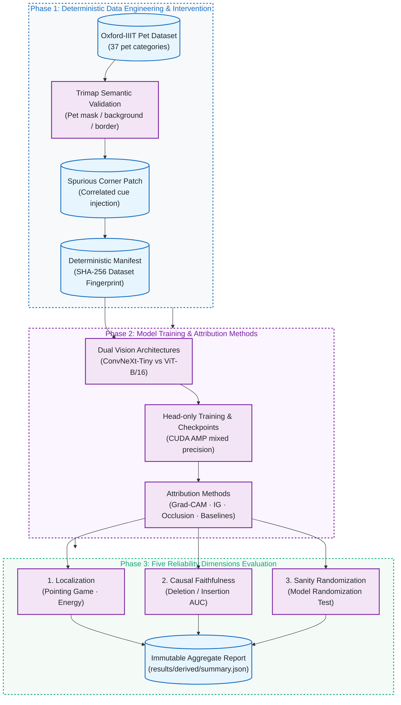
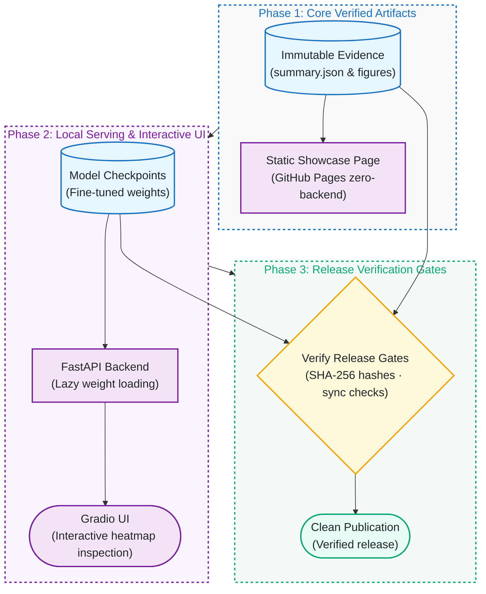

# vision-xai-reliability-lab

[](https://github.com/kuotunyu/vision-xai-reliability-lab/actions/workflows/ci.yml)


[](LICENSE)

**A reliability-first XAI benchmark showing why visually plausible heatmaps can still fail.** ConvNeXt-Tiny and ViT-B/16 are evaluated on Oxford-IIIT Pet across localization, causal faithfulness, model-randomization sanity checks, stability, and a deliberately falsifiable spurious-cue experiment.

[正體中文](README.md) · [→ Explore the results](https://kuotunyu.github.io/vision-xai-reliability-lab/) · [→ Reproduce locally](#quickstart) · [→ Audit the evidence](ARTIFACTS.md) · [→ Read the model card](MODEL_CARD.md)


> **A heatmap is not proof of causal reasoning.** This project measures where attribution methods hold up, where they break, and protects the empirical evidence from being altered by smoke tests or CI runs.

---

## Key Findings & Methodological Insights

1. **Center Prior Exposure**:
   A fixed center prior reached **0.922 pointing-game accuracy** for both model families, beating every evaluated attribution method. That exposes dataset composition bias and is localization evidence, not causal faithfulness.
2. **Integrated Gradients Failed Model-Randomization Sanity Expectation**:
   Its maps retained about 0.47–0.48 absolute Spearman similarity after head randomization, substantially higher than the other evaluated methods (healthy explanations should be sensitive to randomized weights).
3. **Spurious-patch Experiment as a Negative Result**:
   Under this frozen-backbone, head-only regime, the models did not learn the intended shortcut. This honest negative result is not evidence that vision models generally resist spurious cues.

---

## System Architecture & Pipeline

### 1. Multi-dimensional XAI Reliability Pipeline



### 2. Serving Architecture & Static Showcase



---

## Project Status

| Stage | Scope | Status |
|---|---|---|
| Stage 0 | Packaging, lint/type/test gates, Docker CPU path, CI | Complete |
| Stage 1 | Deterministic data pipeline, manifest, fingerprint, masks, resume | Complete |
| Stage 2 | Head-only training, CUDA AMP, checkpoints, `--resume` | Complete |
| Stage 3 | Grad-CAM, Integrated Gradients, Occlusion + three baselines | Complete |
| Stage 4 | Localization, faithfulness, sanity, stability, spurious-cue evaluation | Complete |
| Stage 5 | Machine-generated report and immutable public aggregates | Complete |
| Stage 6 | FastAPI + Gradio application, with lazy weight loading | Complete |

---

## Results (Generated)

Everything between the markers below is generated from `results/derived/summary.json`; nothing is typed in by hand:

<details>
<summary><strong>Full machine-generated result tables</strong></summary>

<!-- RESULTS:BEGIN -->
**Experiment `full`** — generated 2026-07-25T14:53:10.938993+00:00

_experiment 'full': trained on the full dataset; explanations computed on the first 500 samples of the test split. Attribution and reliability metrics therefore describe that fixed subset, not the entire split._

**Classification (clean validation split)**

| variant | val acc | val macro-F1 | val ECE | device | time | peak VRAM |
|---|---|---|---|---|---|---|
| cnn | 0.962 | 0.962 | 0.070 | NVIDIA L4 | 66s | 934.2MB |
| cnn_patched | 0.962 | 0.962 | 0.070 | NVIDIA L4 | 66s | 934.2MB |
| vit | 0.950 | 0.950 | 0.053 | NVIDIA L4 | 69s | 899.3MB |
| vit_patched | 0.952 | 0.953 | 0.050 | NVIDIA L4 | 68s | 899.3MB |

**Localization (all predictions; mean [95% bootstrap CI]) — not causal faithfulness**

| variant | method | energy in mask | pointing game | topk iou 0.1 |
|---|---|---|---|---|
| cnn | center | 0.622 [0.604, 0.639] | 0.922 [0.898, 0.946] | 0.200 [0.192, 0.208] |
| cnn | gradcam | 0.753 [0.740, 0.766] | 0.864 [0.832, 0.894] | 0.206 [0.198, 0.216] |
| cnn | integrated_gradients | 0.505 [0.486, 0.525] | 0.506 [0.464, 0.552] | 0.111 [0.105, 0.117] |
| cnn | occlusion | 0.558 [0.541, 0.574] | 0.678 [0.636, 0.718] | 0.142 [0.137, 0.147] |
| cnn | random | 0.469 [0.451, 0.487] | 0.208 [0.174, 0.244] | 0.086 [0.085, 0.087] |
| cnn | uniform | 0.469 [0.451, 0.487] | 0.024 [0.010, 0.038] | 0.025 [0.022, 0.028] |
| vit | center | 0.622 [0.604, 0.639] | 0.922 [0.898, 0.946] | 0.200 [0.192, 0.208] |
| vit | integrated_gradients | 0.537 [0.520, 0.554] | 0.578 [0.530, 0.620] | 0.124 [0.119, 0.130] |
| vit | occlusion | 0.544 [0.526, 0.561] | 0.626 [0.582, 0.672] | 0.139 [0.132, 0.145] |
| vit | random | 0.469 [0.451, 0.487] | 0.208 [0.174, 0.244] | 0.086 [0.085, 0.087] |
| vit | uniform | 0.469 [0.451, 0.487] | 0.024 [0.010, 0.038] | 0.025 [0.022, 0.028] |

**Faithfulness (deletion lower / insertion higher = better)**

| variant | method | deletion AUC | insertion AUC |
|---|---|---|---|
| cnn | center | 0.456 [0.437, 0.474] | 0.559 [0.542, 0.578] |
| cnn | gradcam | 0.329 [0.313, 0.344] | 0.646 [0.629, 0.664] |
| cnn | integrated_gradients | 0.249 [0.236, 0.261] | 0.309 [0.296, 0.323] |
| cnn | occlusion | 0.501 [0.483, 0.518] | 0.577 [0.559, 0.597] |
| cnn | random | 0.257 [0.244, 0.270] | 0.258 [0.244, 0.270] |
| cnn | uniform | 0.498 [0.479, 0.515] | 0.483 [0.469, 0.497] |
| vit | center | 0.348 [0.330, 0.364] | 0.548 [0.530, 0.565] |
| vit | integrated_gradients | 0.199 [0.187, 0.210] | 0.381 [0.366, 0.397] |
| vit | occlusion | 0.322 [0.306, 0.339] | 0.571 [0.554, 0.588] |
| vit | random | 0.312 [0.297, 0.326] | 0.307 [0.292, 0.321] |
| vit | uniform | 0.446 [0.430, 0.462] | 0.470 [0.455, 0.486] |

**Sanity & stability (|Spearman|): randomization LOW, flip consistency HIGH**

| variant | method | randomization sim. | flip consistency |
|---|---|---|---|
| cnn | gradcam | 0.216 [0.174, 0.259] | 0.858 [0.834, 0.880] |
| cnn | integrated_gradients | 0.481 [0.458, 0.504] | 0.556 [0.538, 0.577] |
| cnn | occlusion | 0.225 [0.189, 0.263] | 0.565 [0.530, 0.598] |
| vit | integrated_gradients | 0.471 [0.451, 0.492] | 0.688 [0.673, 0.702] |
| vit | occlusion | 0.324 [0.268, 0.377] | 0.815 [0.773, 0.855] |

**Spurious corner patch (patched-trained models on three test variants)**

| variant | method | test variant | accuracy | patch energy (patched inputs) | pet-mask energy |
|---|---|---|---|---|---|
| cnn_patched | gradcam | correlated | 0.878 [0.848, 0.908] | 0.002 [0.001, 0.002] | 0.752 [0.740, 0.765] |
| cnn_patched | gradcam | counter_correlated | 0.866 [0.834, 0.896] | 0.001 [0.000, 0.003] | 0.753 [0.740, 0.766] |
| cnn_patched | gradcam | no_patch | 0.868 [0.838, 0.896] | n/a | 0.753 [0.741, 0.766] |
| cnn_patched | integrated_gradients | correlated | 0.878 [0.848, 0.908] | 0.005 [0.004, 0.005] | 0.509 [0.490, 0.528] |
| cnn_patched | integrated_gradients | counter_correlated | 0.866 [0.834, 0.896] | 0.005 [0.004, 0.005] | 0.507 [0.488, 0.527] |
| cnn_patched | integrated_gradients | no_patch | 0.868 [0.838, 0.896] | n/a | 0.506 [0.487, 0.526] |
| vit_patched | integrated_gradients | correlated | 0.836 [0.804, 0.868] | 0.012 [0.011, 0.013] | 0.547 [0.531, 0.564] |
| vit_patched | integrated_gradients | counter_correlated | 0.836 [0.802, 0.868] | 0.013 [0.010, 0.015] | 0.538 [0.521, 0.554] |
| vit_patched | integrated_gradients | no_patch | 0.836 [0.804, 0.868] | n/a | 0.537 [0.520, 0.554] |

_A heatmap is not proof of causal reasoning._
<!-- RESULTS:END -->

</details>

---

## Quickstart

Requires Python ≥ 3.11 and [uv](https://docs.astral.sh/uv/):

```bash
# 1. Sync locked environment (CPU-only Torch)
uv sync --frozen --no-editable

# 2. Self-check and unit tests (uses synthetic fixtures only)
uv run --no-sync python -m vision_xai.cli self-check
uv run --no-sync pytest -q
```

### Dataset Preparation (~800 MB from official Oxford VGG server)

```bash
uv run --no-sync python -m vision_xai.cli data prepare --config configs/smoke.yaml
```

Long runs checkpoint every 32 samples and can be resumed safely:

```bash
uv run --no-sync python -m vision_xai.cli data prepare --config configs/full.yaml --max-items 200
uv run --no-sync python -m vision_xai.cli data prepare --config configs/full.yaml --resume
```

---

## Docker (CPU)

```bash
# Build image and serve API on :8000
docker build -t vision-xai:dev .
docker run --rm -p 8000:8000 vision-xai:dev

# Or use Docker Compose with read-only mounts
docker compose up --build
```

---

## Project Structure & Documentation

```text
configs/            smoke.yaml and full.yaml
src/vision_xai/     Core implementation: config, data pipeline, models, CLI
  data/             source, splits, manifest, fingerprint, trimap, patches, prepare
tests/              pytest unit tests (synthetic fixtures, zero remote dataset dependencies)
app/                FastAPI backend and Gradio interface (Stage 6)
results/            Immutable full aggregate results and safe dataset summary
schemas/            Machine-readable artifact contracts (JSON Schema)
tools/              Release verification and CUDA resume canary auditing tools
```

- [DATA_CARD.md](DATA_CARD.md): Dataset provenance, split manifests, and license boundaries.
- [MODEL_CARD.md](MODEL_CARD.md): Architecture specifications and evaluation scopes.
- [ARTIFACTS.md](ARTIFACTS.md): Immutable release artifacts and SHA-256 checksums.
- [FAILURES.md](FAILURES.md): Negative results and failure analysis.
- [OWNER_ACTIONS.md](OWNER_ACTIONS.md): Maintainer action guides and release verification.

---

## License

Source code licensed under the [MIT License](LICENSE). The Oxford-IIIT Pet dataset is licensed separately by its authors (see [DATA_CARD.md](DATA_CARD.md)).
